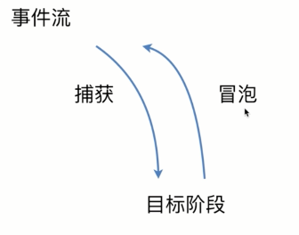
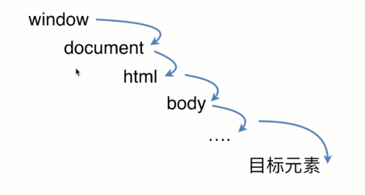
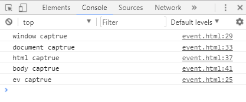

# DOM事件

## 基本概念：DOM事件的级别
<div align="center">
  
</div>

```js
//DOM0  
element.onclick = function(){}

//DOM2 
element.addEventListener('click',function(){},false)

//DOM3
element.addEventListener('onmouseover',function(){},false)
```
::: tip 为啥没有DOM1级事件
  因为在1级DOM标准中没有定义与事件有关的内容，所以事件的级别是没有DOM1的。
:::

**dom0，2，3的区别：**
* 0级是最早的，而且目前所有的浏览器仍支持0级DOM模型。缺点是一个事件的处理程序只能对应一个函数，删除DOM0事件处理程序，只要将对应事件属性置为`null`即可。
* 2级模型中可以为特定对象的事件注册多个事件监听，2级事件的删除 `removeEventListener("click",function(){},false);` 
* 3级事件的操作方式和2级事件是一样的。DOM3级事件模块在DOM2级事件的基础上重新定义了这些事件，也添加了一些新事件。包括IE9在内的主流浏览器都支持DOM2级事件，IE9也支持DOM3级事件。
`UI事件、焦点事件、鼠标事件、滚轮事件、文本事件、键盘事件、合成事件、变动事件`

## DOM事件模型，事件流
**定义**
1. 事件流描述的是从页面中接收事件的顺序,也可理解为事件在页面中传播的顺序。
2. 事件就是用户或浏览器自身执行的某种动作。诸如`click`(点击)、`load`(加载)、`mouseover`(鼠标悬停)。
3. 事件处理程序响应某个事件的函数就叫事件处理程序(或事件侦听器)。

<div align="center">
  
</div>


这两个事件流分别的是IE公司和netspace公司提出来的，冒泡事件流支持的浏览器更多。 
事件捕获阶段：事件从最上一级标签开始往下查找，直到捕获到事件目标(`target`)。
事件冒泡阶段：事件从事件目标(`target`)开始，往上冒泡直到页面的最上一级标签。

## 描述DOM事件捕获的具体流程
事件捕获示意图

<div align="center">
  
</div>


和事件冒泡相反，事件捕获是自上而下执行，我们只需要将`addEventListener`的第三个参数改为`true`就行。

下面通过代码示例来感受一下:
```html
<body>
  <div id="ev">
    <style media="screen">
      #ev{
        width: 300px;
        height: 100px;
        background: red;
        color: #fff;
        text-align: center;
        line-height: 100px;
      }
    </style>
    目标元素
  </div>
  <script type="text/javascript">
    var ev = document.getElementById('ev');
    window.addEventListener('click', function (e) {
      console.log('window captrue');
    }, true);

    document.addEventListener('click', function (e) {
      console.log('document captrue');
    }, true);

    document.documentElement.addEventListener('click', function (e) {
      console.log('html captrue');
    }, true);

    document.body.addEventListener('click', function (e) {
      console.log('body captrue');
    }, true);
  </script>
</body>
```
结果：
<div align="center">
  
</div>
这个例子很好的验证了捕获是由上到下的。

::: tip Notice:
  最上层的是window而不是html
:::

## Event对象的常见应用
event对象的方法是有很多的，像鼠标位置键盘`key`值的这样的就不多说了，下面介绍几个我认为比较重要的。
1. `event.preventDefault()`此方法用来阻止默认的事件，比如阻止a标签的跳转。用法：
```js
dom.addEventListener('click',function(event){
   event.preventDefault() 
},false)
```

2. `event.stopPropagation()`阻止冒泡；让事件停留在当前dom而不会向上传递。

3. `event.stopImmediatePropagation()`, 用于阻止剩余的事件处理函数的执行，并防止当前事件在DOM树上冒泡。

4. `event.target`，`target`事件属性可返回事件的目标节点（触发该事件的节点），如生成事件的元素、文档或窗口。

5. `event.currentTarget`， `currentTarget` 事件属性返回其监听器触发事件的节点，即当前处理该事件的元素、文档或窗口。在捕获和起泡阶段，该属性是非常有用的，因为在这两个节点，它不同于 `target` 属性。

::: tip currentTarget与target的区别
  `event.currentTarget`指向事件所绑定的元素，而`event.target`始终指向事件发生时的元素
:::

## 自定义事件
这部分直接通过代码来感受一下吧
```js
var eve = new Event('test');
ev.addEventListener('test', function () {
　　console.log('test dispatch');
});
setTimeout(function () {
　　ev.dispatchEvent(eve);
}, 1000)
```
一秒钟后，控制台打印 `test dispatch`