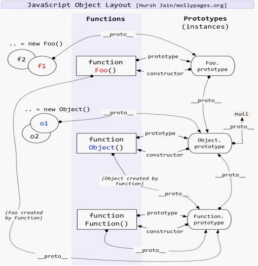

# Javascript 原型链

## 创建对象的几种方法

在了解原型链之前，首先先了解一下创建对象的几种方式，介绍以下三种。

```js
  // 第一种方式：字面量
  var o1 = {name: 'o1'}
  var o2 = new Object({name: 'o2'})
    // 第二种方式：构造函数
  var M = function (name) { this.name = name; }
  var o3 = new M('o3')
    // 第三种方式：Object.create
  var p = {name: 'p'}
  var o4 = Object.create(p)

  console.log(o1)　　　　
  console.log(o2)
  console.log(o3)
  console.log(o4)
```

打印结果：
<div align="center">
  
</div>

对象是创建出来了，但你可能对结果很诧异，为什么不同呢？别急，慢慢来。

## 原型、构造函数、实例、原型链

先来一张容易让人懵逼的图
<div align="center">
  
</div>

### 什么是原型对象？实例？构造函数？

概念就不多说了，看代码吧
```js
var M = function (name) { this.name = name; }
var o3 = new M('o3')
```

* 实例就是对象，在本例中`o3`就是实例，`M`就是构造函数。
* 实例通过`new`一个构造函数生成的。
* 从上图中可以知道，实例的`__protpo__`指向的是原型对象。
* 实例的构造函数的`prototype`也是指向的原型对象。 
* 原型对象的`construor`指向的是构造函数。
 
再来通过下面这个图来理解一下：
<div align="center">
  
</div>

### 什么是原型链？

简单理解就是原型组成的链，对象的`__proto__`它的是原型，而原型也是一个对象，也有`__proto__`属性，原型的`__proto__`又是原型的原型，就这样可以一直通过`__proto__`向上找，这就是原型链，当向上找找到Object的原型的时候，这条原型链就算到头了。

### 原型对象和实例之间有什么作用？

通过一个构造函数创建出来的多个实例，如果都要添加一个方法，给每个实例去添加并不是一个明智的选择。这时就该用上原型了。

在实例的原型上添加一个方法，这个原型的所有实例便都有了这个方法。

接着上面的例子继续演示：

```js
var M = function (name) { this.name = name; }
var o3 = new M('o3')
var o5 = new M()
o3.__proto__.say=furnction(){
   console.log('hello world')
}

o3.say() // hello world
o5.say() // hello world
```

按照JS引擎的分析方式，在访问一个实例的属性的时候，现在实例本身中找，如果没找到就去它的原型中找，还没找到就再往上找，直到找到，这就是原型链。

::: tip 注意：
  只有函数有[prototype],对象是没有的，但是函数也是有`__proto__`的，因为函数也是对象。函数的`__proto__`指向的是`Function.prototype`，也就是说普通函数是`Function`这个构造函数的一个实例。
:::

```js
  M__proto__ === Function.prototype  // true
```

## instanceof的原理
<div align="center">
 
</div>

instanceof是判断实例对象的`__proto__`和生成该实例的构造函数的`prototype`是不是引用的同一个地址,是返回`true`，否返回`false`。

::: tip 注意：
实例的`instanceof`在比较的时候，与原型链上向上找的的构造函数相比都是`true`。
:::

```js
o3.__proto__ === M.prototype                  // true
o3 instanceof M                               // true
M.prototype.__proto__ === Object.prototype    // true
o3 instanceof Object                          // true
```

那怎么判断实例是由哪个构造函数生成的呢？这时候就要用到`constructor`了。
实例的原型的构造函数， `obj.__proto__.constructor`

```js
o3.__proto__.constructor === M        // true
o3.__proto__.constructor === Object   // false
```

## new运算符

**new运算符的原理**

* 一个新对象被创建。它继承自`foo.prototype`。
* 构造函数返回一个对象。在执行的时候，相应的传参会被传入，同时上下文`this`会被指定为这个新的实例。
* `new foo`等同于`new foo()`, 只能用在不传递任何参数的情况。
* 如果构造函数反悔了一个对象，那个这个对象会取代整个`new`出来的结果。如果构造函数没有返回对象，那个`new`出来的结果为步骤1创建的对象。

```js
var new2 = function (func) {
  var o = Object.create(func.prototype); 　　  //创建对象
  var k = func.call(o);　　　　　　　　　　　　　//改变this指向，把结果付给k
  if (typeof k === 'object') {　　　　　　　　　//判断k的类型是不是对象
      return k;　　　　　　　　　　　　　　　　　 //是，返回k
  } else {
      return o;　　　　　　　　　　　　　　　　　 //不是返回返回构造函数的执行结果
  }
}   
```

<div align="center">
 
</div>

经过上图一系列折腾，不难看出，我们手动编写的new2和new运算符的作用是一样的。

::: tip 总结：
函数的原型对象`constructor`默认指向函数本身，原型对象除了有原型属性外，为了实现继承，还有一个原型链指针`__proto__`，该指针指向上一层的原型对象，而上一层的原型对象的结构依然类似，这样利用`__proto__`一直指向`Object`的原型对象上，而`Object`的原型对象用`Object.prototype.__proto__ = null`表示原型链的最顶端，如此变形成了`javascript`的原型链继承，同时也解释了为什么所有的`javascript`对象都具有`Object`的基本方法。

:::


最后献上我珍藏多年的图，再来理解一下JS的原型：
<div align="center">
 
</div>
