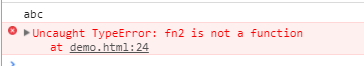
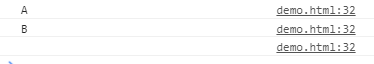
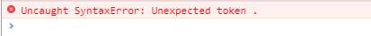
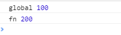

# JavaScript 作用域和闭包

## 变量提升
首先我们要知道，js 的执行顺序是由上到下的，但这个顺序，并不完全取决于你，因为 js 中存在变量的声明提升。
这里比较简单，直接上代码：

```js
console.log(a); //undefined
var a = 100;

fn("zhangsan");
function fn(name) {
  age = 20;
  console.log(name, age); //zhangsan 20
  var age;
}
```

打印`a`的时候，`a`并没有声明，为什么不报错，而是打印`undefined`。
执行`fn`的时候`fn`并没有声明，为什么`fn`的语句会执行？
这就是变量的声明提升，代码虽然写成这样，但其实执行顺序是这样的。

```js
var a;

function fn(name) {
  age = 20;
  console.log(name, age);
}

console.log(a);
a = 100;

fn("zhangsan");
```

js 会把所有的声明提到前面，然后再顺序执行赋值等其它操作，因为在打印`a`之前已经存在`a`这个变量了，只是没有赋值，所以会打印出`undefined`，为不是报错，`fn`同理。

这里要注意函数声明和函数表达式的区别。上例中的`fn`是函数声明。接下来通过代码区分一下。

```js
fn1("abc");
function fn1(str) {
  console.log(str);
}

fn2("def");
var fn2 = function(str) {
  console.log(str);
};
```

本例中 fn1 是函数声明，而 fn2 是函数表达式。函数表达式中的函数体是不会被提升的。

结果：

<div align="center">
  
</div>

可以看到 fn1 被提升了，而 fn2 的函数体并没有被提升。

效果等同于：

```js
var fn2;
fn2("def");
fn2 = function(str) {
  console.log(str);
};
```

## this 的使用场景

`this`简单理解就是调用函数的那个对象。
要搞懂`this`，首先要理解一句话：`this`要在执行时才能确认，定义时无法确认。

接下来还是在代码中解释这句话

```js
var a = {
  name: 'A'
  fn: function () {
      console.log(this.name)
  }
}
```

看这段代码，`this`指向谁？
现在说指向谁都是不对的，`this`在定义时是无法确认的，只有执行时才能确认。
继续上面代码，判断以下`this`的指向。

```js
a.fn(); //this === a

a.fn.call({ name: "B" }); //this === {name: 'B'}

var fn1 = a.fn;
fn1(); //this === window
```

代码中已经给出答案了。虽然`fn`定义在`a`对象里，但是`fn`中`this`的指向并不总是指向`a`，谁调用`fn`，`this`就指向谁。
看一下输出结果：

<div align="center">
  
</div>

`window`没有`name`属性，所以最后一行为空。

this 都有哪种使用场景呢？
主要由以下 4 点

1. 作为构造函数执行
2. 作为对象属性执行
3. 作为普通函数执行
4. call apply bind

```js
//作为构造函数执行
function (name){
    this.name = name
}
var f = new Foo('zhangsan')

//作为对象属性
var obj = {
    name: 'A'
    printName:function(){
        console.log(this.name)
    }
}
obj.printName()

//作为普通对象
function fn(){
    console.log(this) //此时的this指向window
}
fn()
```

前三种通过代码一看就明白了，不用多说，接下说一下`call`、`apply` 和 `bind`
这三个的作用都是改变`this`的指向，`call`和`apply`不同的地方就在于传递参数的部分，`apply`要用数组，还是在代码中看。

```js
function fn1(name, age) {
  console.log(name, age);
  console.log(this);
}

//call和apply用法的不同
fn1.call({ x: 100 }, "zhangsan", 21);
fn1.apply({ x: 100 }, ["zhangsan", 21]); //参数放在数组里
```

`call`和`apply`的第一个参数都是`this`的指向，之后是构造函数的参数。
输出结果：

<div align="center">
  
</div>

可以看到，两种方式的输出结果是一样的。
再然后是`bind`，`bind`和前面两个都不太一样，`bind`不是在函数执行时调用的，而是在函数声明时。

看代码：

```js
var fn2 = function(name, age) {
  console.log(name, age);
  console.log(this);
}.bind({ y: 200 }); //在函数声明时绑定this的指向

fn2("lisi", 22);
```

结果：

<div align="center">
  
</div>

有一点需要注意，只有函数表达式才能使用 bind，函数声明是不能用的，来一个错误的演示：

```js
//错误演示
function fn3(name,age){
    console.log(name,age)
    console.log(this)
}.bind({z:300})    //错误演示

//错误演示
fn3('lisi',23)
```

<div align="center">
  
</div>

## 作用域

首先要知道，JavaScript 是没有块级作用域的，下面的例子会正常运行，没有报错

```js
if (true) {
  var name = "zhangsan";
}

console.log(name); // zhangsan
```

其次，还要知道全局作用域和函数作用域

```js
var a = 100;

function fn() {
  var a = 200;
  console.log("fn", a); //这里的a是200
}

console.log("global", a); // 这里的a是100
fn();
```

在函数里声明的变量，在是不会影响外面的变量的，看结果：

<div align="center">
  
</div>

这些都了解了后，我们来看作用域链。

```js
var a = 100;
function fn() {
  var b = 200;
  console.log(a); //a为自由变量 // 100
  console.log(b); // 200
}
fn();
```

还要注意一点，作用域链实在定义时确定的，不是在执行时，不管在哪个作用域下调用某个函数，该函数内的作用域链是不会变得，再来看一段代码：

```js
var x = 100;
function F1() {
  var y = 200;
  function F2() {
    var z = 300;
    console.log(x); //自由变量
    console.log(y); //自由变量
    console.log(z);
  }
  F2();
}
F1();
```

我们看`x`变量，这是一个自由变量，`js引擎`在执行到`console.log(x)`时，会先在`F2`中寻找`x`，没找到就去当前作用域的父级作用域`F1`中找，还找不到就在往上找直到全局作用域。

因为定义时作用域链已经确定了，不管这条链上的函数是在哪里调用的，这条作用域链不会在改了。

## 闭包的应用

出于种种原因，我们有时候需要得到函数内的局部变量。但是，前面已经说过了，正常情况下，这是办不到的，只有通过变通方法才能实现。

那就是在函数的内部，再定义一个函数,然后把这个函数返回。

```js
function F1() {
  var a = 100;
  //返回一个函数 (函数作为返回值)
  return function() {
    console.log(a);
  };
}
//f1得到一个函数
var f1 = F1();
var a = 200;
f1(); // 100
```

在本例中就实现了闭包，简单的说，闭包就是能够读取其他函数内部变量的函数。

下面说为什么打印的是 100
看这句 `var f1 = F1()`; `F1`这个函数执行的结果是返回一个函数，所以就相当于把 F1 内的函数付给了 f1 变量，类似于这样

```js
var f1 = function() {
  console.log(a); //这里的a是一个自由变量
};
```

这里的`a`是一个自由变量，所以根据作用域链的原理，就应该去上一级作用域去找。之前说过，作用域链在定义时确定，和执行无关，那就去想上找，这个函数定义定义在`F1`中，所以会在`F1`中找`a`这个变量，所以这里会打印的 100。

通过这种方式，我们在全局下就读取到了`F1`函数内部定义的变量，这就是闭包。

**闭包主要有以下两种应用场景**
* 函数作为返回值
* 函数作为参数来传递

```js
function F1() {
  var a = 100;
  return function() {
    console.log(a);
  };
}
var f1 = F1();

function F2(fn) {
  var a = 200;
  fn();
}
F2(f1); // 100
```

**例题**
创建 10 个`<a>`标签，点击的时候输出对应的序号

```js
// 错误代码演示
var i, a;
for (i = 0; i < 10; i++) {
  a = document.createElement("a");
  a.innerHTML = i + "<br />";
  a.addEventListener("click", function(e) {
    e.preventDefault();
    console.log(i); // 10
  });
  document.body.appendChild(a);
}
```

因为上例代码都是同步执行的，在页面加载的一瞬间，`for` 循环已经执行完毕，我再去点标签的时候，i 的值已经是 10 了，所以不管我点第几个标签，打印的都会是 10。

以下是正确代码：
```js
for (var i = 0; i < 10; i++) {
  (function(i) {
    a = document.createElement("a");
    a.innerHTML = i + "<br />";
    a.addEventListener("click", function(e) {
      e.preventDefault();
      console.log(i);
    });
    document.body.appendChild(a);
  })(i);
}
``` 
