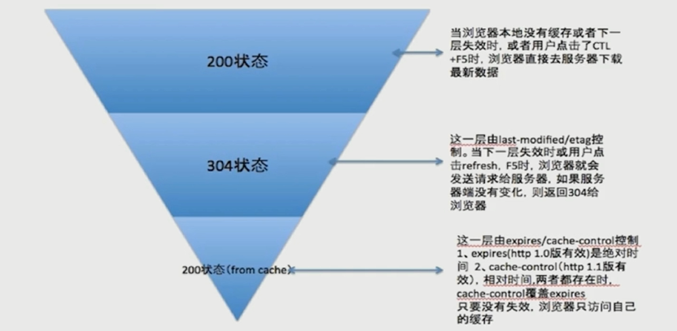

# [前端性能优化](https://coding.imooc.com/class/chapter/130.html)

[思维导图](https://processon.com/view/59e74772e4b05f52bada3e27)

  WEB前端本质上是一种GUI软件，本可以直接借鉴其它GUI系统架构设计方案，但WEB前端有点特别：传统的CS架构的GUI软件，是软件开发完后，将软件打包发布到相关的应用平台上，需要用户从应用平台下载到本地解压安装后使用，实际上用户在使用软件时，用户本地是在访问本地的一些资源，而WEB前端（BS架构）则是开发完后将代码发布到服务器、cdn上，用户使用时，只需要通过浏览器访问网址，而浏览器则会向远程的服务器发送请求，服务器返回相关资源，这个过程是一个动态的增量的加载相关资源；所以缩短服务器向浏览器返回数据的时间就能让客户的体验更好。

首先了解一下，浏览器的一个请求从发送到返回都经历了什么？
<div align="center">
  
</div>

**请求过程中一些潜在的性能优化点：**
* dns可以通过缓存，减少dns查询时间
* 网络请求的过程走最近的网络环境
* 相同的静态资源缓存
* 减少请求http请求大小
* 减少http请求
* 服务端渲染


## 资源合并与压缩

**资源合并与压缩主要就是减少http请求数量和减少请求资源大小**

资源压缩可以从以下几个方面着手：
* html压缩
  * nodejs提供的html-minifier
  * 后端模板引擎渲染压缩
* css压缩(无效代码删除, css语义合并)
  * html-minifier对html中的css进行压缩
  * clean-css对css进行压缩
* js的压缩与混乱(无效字符的删除、剔除注释、代码语义的缩减和优化、代码保护)
  * html-minifier对html中的js进行压缩
  * uglifyjs2对js进行压缩
* 文件合并
  * 文件与文件之间有插入的上行请求，增加了N-1个网络延迟受
  * 丢包问题影响更严重
  * 经过代理服务器时可能会被断开
* 开启gzip

## 图片相关的优化

**png8/png24/png32之间的区别**
* png8 —— 256色 + 支持透明
* png24 —— 2^24色 + 不支持透明
* png32 —— 2^24色 + 支持透明 

**不同格式图片常用的业务场景**
* jpg有损压缩，压缩率高，不支持透明
* png支持透明，浏览器兼容好
* webp压缩程度更好，在ios webview有兼容性问题 
* svg矢量图，代码内嵌，相对较小，图片样式相对简单的场景

**优化方案**
* 进行图片压缩
* CSS雪碧图(减少你的网站的HTTP请求数量)
* Image inline(将图片的内容内嵌到html当中)
* 使用SVG进行矢量图的绘制
* 使用iconfont解决icon问题
* 在安卓下使用webp

## 懒加载与预加载

**懒加载**
* 图片进入可视区域之后请求图片资源
* 对于电商等图片很多，页面很长的业务场景适用
* 减少无效资源的加载
* 并发加载的资源过多会阻塞JS的加载，影响网站的正常使用

**懒加载实现原理**
判断图片距离可视区顶部的距离是否小于可视区的高度，如果小于则加载图图片资源，使用lazyload时必须固定图片的宽高
```html
<div class="image-list">
  
  
  
  
  
  
  
  
  
  
  
  
</div>
```

```js
const viewHeight = document.documentElement.clientHeight // 可视区高度
function lazyload() {
  const eles = document.querySelectAll('img[data-original][lazyload]')

  Array.prototype.forEach.call(eles, (item, index) => {
    let rect
    if (item.dataset.original === '') return
    rect = item.getBoundingClientRect()
    if (rect.bottom >= 0 && rect.top < viewHeight) {
      !function() {
        const img = new Image()
        img.src = item.dataset.original
        img.onload = function() {
          item.src = img.src
        }
        item.removeAttribute('data-original')
        item.removeAttribute('lazyload')
      }()
    }
  })
}

lazyload()
document.addEventListener('scroll', lazyload)
```

**预加载**
* 图片等静态资源在使用之前的提前请求
* 资源使用到时能从缓存中加载，提升用户体验
* 页面展示的依赖关系维护

**预加载的实现**
* 直接使用img标签，并设置`style="display: none;"`
* 使用img对象`new Image()`
* 使用ajax（XMLHttpRequest）请求
  * 优点：可以精细的控制，监听请求过去
  * 缺点：不能跨域
* PreloadJS库


## 重绘回流

html 页面加载渲染的过程
<div align="center">
  
</div>

**回流（Reflow）**

`当render tree中的一部分(或全部)因为元素的规模尺寸，布局，隐藏等改变而需要重新构建,这就称为回流(reflow)；当页面布局和几何属性改变时就需要回流`
::: tip 注意：
  回流必将引起重绘，而重绘不一定会引起回流
:::

**重绘（Paint）**

`当render tree中的一些元素需要更新属性，而这些属性只是影响元素的外观，风格，而不会影响布局的，比如background-color，则就叫称为重绘。`

**触发页面重布局的属性**
* 盒子模型相关属性会触发重布局
* 定位属性及浮动也会触发重布局
* 改变节点内部文字结构也会触发重布局

`width、height、padding、margin、display、border-width、border、min-height、top、bottom、left、right、position、float、clear、text-align、overflow-y、font-weight、overflow、font-family、line-height、vertival-align、white-space、font-size`

**只触发重绘的属性**

`color、border-style、border-radius、visibility、text-decoration、background、background-image、background-position、background-repeat、background-size、outline-color、outline、outline-style、outline-width、box-shadow`

**新建DOM的过程**
1. 获取DOM后分割为多个图层
2. 对每个图层的节点计算样式结果（Recalculate style--样式重计算）
3. 为每个节点生成图形和位置（Layout--回流和重布局）
4. 将每个节点绘制填充到图层位图中（Paint Setup和Paint--重绘）
5. 图层作为纹理上传至GPU
6. 符合多个图层到页面上生成最终屏幕图像（Composite Layers--图层重组）

**Chrome创建图层的条件（devtool: performance、layout）**
* 3D或透视变换（perspective / transform: translateZ(0) / will-change: transform）CSS属性
* 使用加速视频解码的video节点
* 拥有3D（WebGL）上下文或加速的2D上下文的canvas节点
* 混合插件（如Flash）
* 对自己的opacity做CSS动画或使用一个动画webkit变换的元素
* 拥有加速CSS过滤器的元素
* 元素有一个包含复合层的后代节点（一个元素拥有一个子元素，该子元素在自己的层里）
* 元素有一个z-index较低且包含一个复合层的兄弟元素（换句话说就是该元素在复合层上面渲染）


**实战优化点**
1. 用translate替代top改变
2. 用opacity替代visibility
3. 不要一条一条地修改 DOM 的样式，预先定义好 class，然后修改 DOM 的 className
4. 把 DOM 离线后修改，比如：先把 DOM 给 display:none (有一次 Reflow)，然后你修改100次，然后再把它显示出来
5. 不要把 DOM 结点的属性值放在一个循环里当成循环里的变量
6. 不要使用 table 布局，可能很小的一个小改动会造成整个 table 的重新布局
7. 动画实现的速度的选择
8. 对于动画新建图层
9. 启用 GPU 硬件加速

## 浏览器存储

### Cookie

**优点：**
  1. 因为HTTP请求无状态，所以需要cookie去维持客户端状态
  2. 过期时间expire
  3. cookie的生成方式：
    * http response header中的set-cookie
    * js中可以通过document.cookie可以读写cookie

**缺点：**
  1. 仅仅作为浏览器存储，大小4KB左右，能力被localstorage代替
  2. ookie在相关域名下面都会携带， cdn的流量损耗，`解决方法：cdn 的域名和主站域名分开`

::: tip HttpOnly
  如果在Cookie中设置了HttpOnly属性，那么通过js脚本将无法读取到cookie信息，这样能有效的防止XSS攻击
:::

### LocalStorage与SessionStorage

**相同点：**
  1. HTML5设计出来专门用于浏览器存储的
  2. 大小为5M左右
  3. 仅在客户端使用，不与服务端进行通信
  4. 接口封装较好

**异同点：**
  1. Sessionstorage为会话级别的浏览器存储（可用于表单信息的维护）
  2. LocalStorage浏览器本地缓存的方案

### IndexDB

1. IndexedDB 是一种低级API，用于客户端存储大量结构化数据(包括, 文件/ blobs)。该API使用索引来实现对该数据的高性能搜索。虽然 Web Storage 对于存储较少量的数据很有用，但对于存储更大量的结构化数据来说，这种方法不太有用。IndexedDB提供了一个解决方案。
2. 为应用创建离线版本

具体使用方法可以查看：
* [浏览器数据库 IndexedDB 入门教程](http://www.ruanyifeng.com/blog/2018/07/indexeddb.html)
* [MDN web docs IndexedDB](https://developer.mozilla.org/zh-CN/docs/Web/API/IndexedDB_API)

### Service Worker

  Service Worker 是一个脚本，浏览器独立与当前网页，将其在后台运行，为实现一些不依赖页面或者用户交互的特性打开了一扇大门。在未来这些特性将包括推送消息，背景后台同步，Gepfencing(地理围栏定位)，但它将推出的第一个首要特性，就是拦截和处理网络请求的能力，包括以编程方式来管理被缓存的响应。

  * 使用拦截和处理网络请求的能力，去实现一个离线应用
  * 使用Service Worker 在后台运行的同时能和页面通信的能力，去实现大规模后台数据的处理

**Service Worker 的生命周期**
  <div align="center">
    
  </div>

Chrome内置的Service Worker工具：

* <a href="chrome://serviceworker-internals/" target="_blank">chrome://serviceworker-internals/</a>
* <a href="chrome://inspect/#service-workers" target="_blank">chrome://inspect/#service-workers</a>

### [PWA](https://lavas.baidu.com/pwa)

Progressive Web App, 简称 PWA，是提升 Web App 的体验的一种新方法，能给用户原生应用的体验。

PWA 能做到原生应用的体验不是靠特指某一项技术，而是经过应用一些新技术进行改进，在安全、性能和体验三个方面都有很大提升，PWA 本质上是 Web App，借助一些新技术也具备了 Native App 的一些特性，兼具 Web App 和 Native App 的优点。

PWA 的主要特点包括下面三点：
  * 可靠 - 即使在不稳定的网络环境下，也能瞬间加载并展现
  * 体验 - 快速响应，并且有平滑的动画响应用户的操作
  * 粘性 - 像设备上的原生应用，具有沉浸式的用户体验，用户可以添加到桌面

PWA 本身强调渐进式，并不要求一次性达到安全、性能和体验上的所有要求，开发者可以通过 PWA Checklist 查看现有的特征。
[Lighthouse](https://chrome.google.com/webstore/detail/lighthouse/blipmdconlkpinefehnmjammfjpmpbjk?hl=zh-CN)这款chrome插件可以帮助你测试网站或软件

* `Vue`的PWA解决方案[LAVAS](https://lavas.baidu.com/)

## 缓存

缓存是优化性能、提升体验是一个重要方案。HTTP协议里也包含了控制缓存的部分，通过Cache-Control首部字段来控制，将响应数据缓存至浏览器本地或Web代理中，以达到减少网络延迟及数据传输的开销。
  <div align="center">
    
  </div>

### Cache-Control

  可设置的属性值max-age 最大缓存时间，优先级高，s-maxage，public，private，no-cache，no-store
  <div align="center">
    
  </div>

  资源的缓存策略主要还是在服务器端控制，在响应头中设置Cache-Control参数，可按下图中的维度与步骤来设计：
  <div align="center">
    <a href="https://zhuanlan.zhihu.com/p/29697651" target="_blank">
      
    </a>
  </div>

  1. 响应是否可复用，有的场景缓存命中率很低，就没必要设置缓存，设置 Cache-Control:no-store 指令；
  2. 响应可复用时，首先看客户端对数据一致性要求，强一致则需要设置Cache-Control:no-cache 指令，客户端在使用缓存的资源之前，必须先与服务器确认资源是否有变更，如果资源未被更改，可以避免下载。验证响应是否被修改，是通过请求头If-None-match和响应头ETag来实现的；
  3. 响应可复用时，还要考虑缓存是否能共用，Cache-Control:public 指响应可在Web代理中缓存，多个客户端可共用该响应；Cache-Control:private 指响应只缓存中客户端本地，只能自己使用；
  4. 最后要设置缓存过期时间，在max-age指定的时间之内，客户端不会向服务器发送任何请求，包括验证缓存是否有效的请求，也就是说，如果在这段时间之内，服务器上的资源发生了变化，那么客户端将不能感知，仍使用老版本数据。所以在设置缓存时间时，需要慎重。

::: tip 常见的组合有：
  * Cache-Control: private,no-cache,max-age=0 
  * Cache-Control: public, max-age=7200
:::

### Expires
  * 缓存过期时间，用来指定资源到期的时间，是服务器端的具体时间点
  * 告诉浏览器在过期时间前可以直接从浏览器缓存中读取数据，而无需再次请求

### Last-Modified/If-Modified-Since

* 基于客户端和服务端协商的缓存机制
* last-modified -- response header
* if-modified-since -- request header
* 需要与cache-control共同使用
* 缺点：
  * 某些服务端不能获取精确的修改时间
  * 文件修改时间改了，但文件内容却没有变

### Etag/If-None-Match

* 文件内容的hash值
* Etag -- response header
* if-none-match -- request header
* 需要与cache-control共同使用

**分级缓存策略**
 <div align="center">
    
  </div>

[流程图](https://www.cnblogs.com/etoah/p/5579622.html)
  <div align="center">
    
  </div>